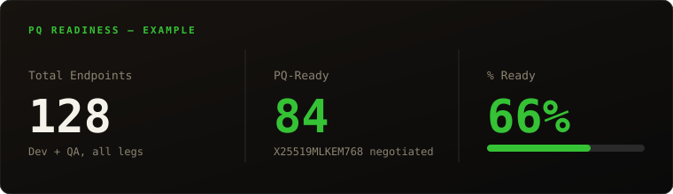
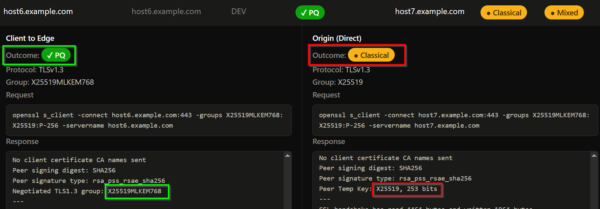

# PQ Radar

A post-quantum TLS/SSH/FTPS readiness scanner. Checks whether your hostnames and
origin servers are actually negotiating a post-quantum hybrid key exchange, or
silently falling back to classical crypto — across five legs: client-to-edge,
direct-to-origin, SSH, FTPS implicit, and FTPS explicit.

Architecture: a Cloudflare Worker (TypeScript) as the API/UI layer, a D1
database (SQLite) for state, and a Python probe container (Cloudflare
Containers) that does the actual `openssl s_client` / SSH / FTPS handshakes.
See `docs/architecture.html` for the full picture.

This repo ships with no real account IDs, zones, subnets, or secrets — you
configure your own following the steps below.

## Screenshots



*(Illustrative numbers — a fresh install starts at 0 until you scan.)*

**Proof, not just a badge** — the actual `openssl s_client` exchange behind every verdict, hostnames/IPs redacted (`?redact=1`). Here, the origin leg fell back to a classical group while the edge still negotiated PQ — exactly the gap this tool exists to catch.



## Prerequisites

- Node.js and npm
- A Cloudflare account (the one this Worker deploys into — can be the same
  account you want to scan, or different)
- Docker running locally (the probe container is built and deployed as part
  of `wrangler deploy`)
- Cloudflare API token(s) for whichever account(s) you want to scan zones/DNS
  from — needs Zone → Zone → Read and Zone → DNS → Read permissions, scoped
  to that account

## Setup

1. **Install dependencies**
   ```
   npm install
   ```

2. **Log in to Cloudflare**
   ```
   npx wrangler login
   ```

3. **Create a D1 database**
   ```
   npx wrangler d1 create pq-radar
   ```
   Copy the `database_id` from the output into `wrangler.jsonc`'s
   `d1_databases[0].database_id` (replacing `REPLACE_WITH_YOUR_D1_DATABASE_ID`).

4. **Bootstrap the schema, then run migrations** — two separate steps, in
   this order. `schema.sql` creates the original baseline tables (`subnets`,
   `scan_config`, `results`); everything in `migrations/` is incremental on
   top of that baseline, so it has to run second.
   ```
   npx wrangler d1 execute pq-radar --remote --file=schema.sql
   npx wrangler d1 migrations apply pq-radar --remote
   ```

5. **Set secrets** (never go in `wrangler.jsonc` — these are encrypted, not
   committed anywhere)
   ```
   npx wrangler secret put TRIGGER_SECRET
   npx wrangler secret put CF_API_TOKEN
   npx wrangler secret put CF_API_TOKEN_QA
   ```
   - `TRIGGER_SECRET` — a secret you make up. Gates every API endpoint and the
     web UI's login screen (Bearer token / paste-once-per-session).
   - `CF_API_TOKEN` / `CF_API_TOKEN_QA` — Cloudflare API tokens for the two
     accounts whose zones you want to scan (referred to as "dev" and "qa"
     throughout the app — you can point both at the same account if you only
     have one environment).

6. **Set the target account IDs** in `wrangler.jsonc`'s `vars` — replace
   `REPLACE_WITH_YOUR_DEV_CLOUDFLARE_ACCOUNT_ID` and the QA equivalent with
   the real account IDs (found on the right sidebar of any zone's Overview
   page in the Cloudflare dashboard, for the account each token belongs to).

7. **Deploy**
   ```
   npx wrangler deploy
   ```

8. **(Optional) Configure subnets to scan directly by CIDR**, beyond whatever
   DNS records get pulled in step 9. Origins outside every configured subnet
   still get scanned automatically as "extra" targets, so this step is only
   needed if you want exhaustive address-by-address CIDR sweeps of your own
   network ranges.
   ```
   npx wrangler d1 execute pq-radar --remote --command \
     "INSERT INTO subnets (cidr, label, enabled) VALUES ('YOUR.CIDR.HERE/24', 'label', 1)"
   ```

9. **First run**: visit `/readiness` on your deployed Worker, unlock with the
   `TRIGGER_SECRET` you set in step 5, click **"Pull zones from Cloudflare"**
   to sync your DNS records, then **"Run full scan"**.

## Local testing without a full deploy

`container/test-*.json` are standalone request bodies for exercising the
probe container directly (not wired into any script — nothing in the app
references them by name). They use public test targets
(`cloudflare.com`, `badssl.com`, the reserved `192.0.2.1` documentation
range) so they're safe to run as-is.

## License

Apache License 2.0 — see [LICENSE](LICENSE).
